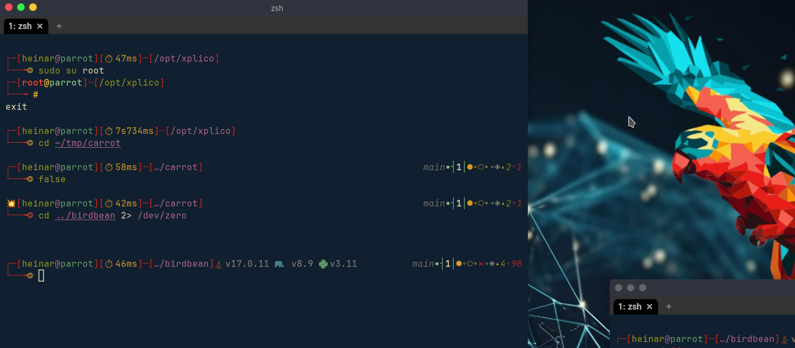

A parrot-os inspired preset for [starship](https://starship.rs/)



## Prerequisites

A nerd font is required to use this preset. You can download one from [nerdfonts.com](https://www.nerdfonts.com/font-downloads) or install it using your package manager.

## Installation

Downloads the `parrot-os.toml` file and places it in your `~/.config/starship.toml` file:

```bash
curl -o ~/.config/starship.toml https://raw.githubusercontent.com/snaeil/parrot-os.starship/main/starship.toml
```

### Using nix home-manager

Add the content of [starship.niy](./starship.nix) to your `home.nix` file.

## Credits

- [Parrot OS](parrotsec.org) for the inspiration
- [Starship](https://starship.rs/) for the shell prompt
- [Nerd Fonts](https://www.nerdfonts.com/) for the beautiful icons
- The starship presets [Nerd Font Symbols](https://starship.rs/presets/nerd-font) and [Jetpack](https://starship.rs/presets/jetpack)

## Contributing

This is not yet complete. Feel free to open an issue or a pull request if you have any suggestions or improvements.
